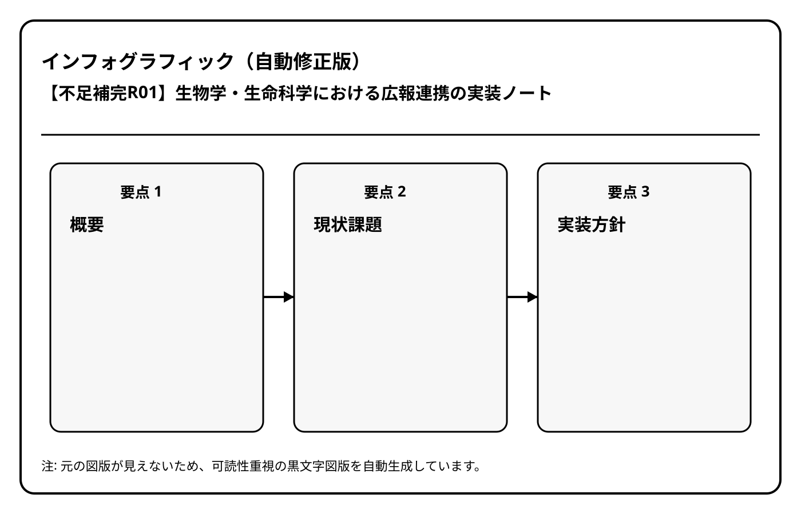

# 【不足補完R01】生物学・生命科学における広報連携の実装ノート

## 概要
本記事は `生物学・生命科学` カテゴリにおける `広報連携` の不足項目を補完するために作成した実装ノートです。  
現場で運用しやすい構成を意識し、課題整理・対応手順・次アクションを短時間で確認できる形式にしています。

## 現状課題
- 情報の粒度や記録形式が揃っておらず、比較・集計がしづらい
- 担当者依存の判断が残り、再現性が低い
- 振り返りのための定量指標が不足している

## 実装方針
1. 運用単位（週次・月次・イベント単位）を定義する
2. 必須記録項目と任意記録項目を分離する
3. 判断基準をチェックリスト化して担当者間で共有する
4. 1か月ごとにレビューし、運用SOPに反映する

## 具体施策
- 入力テンプレートを統一し、記録漏れを防止する
- KPI（例: 実施率、完了率、異常検知件数）を最小セットで運用する
- 関連カテゴリ間のリンクを整備し、参照導線を短縮する

## 次アクション
- 一次版テンプレートを運用に投入（2週間）
- KPIの閾値を仮設定し、月次で見直し
- 関連記事の相互リンクを追加し、検索性を改善

## 関連リンク
- [[10_生物学・生命科学]]
- [[00_Index/index]]
- [[00_Index/運用ガイド]]

## インフォグラフィック

